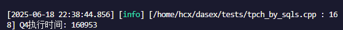
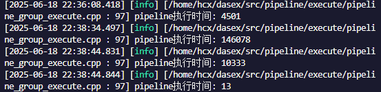
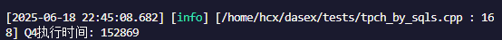
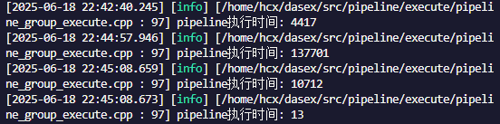
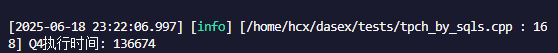
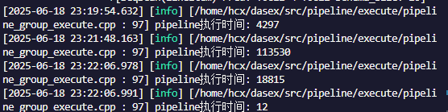

# 性能优化报告/文档

---

### 韩晨旭 李畅

---

## Hash Join性能优化

为了提高TPCH测试中各种查询的性能，我们着重对Hash Join算子进行了一系列优化。

未进行优化改动时，原本运行TPCH-Q4的速度：





### 哈希冲突造成的性能影响

在Hash Join算子执行的过程中，哈希冲突对性能的影响是显著的，比如以下几个方面：

+ **探测成本增加**：在Probe阶段，每个键通过hash值定位到桶(bucket)，再线性查找比较桶内的所有entry。如果哈希冲突严重，每个桶内entry数量多，导致遍历成本上升。
+ **Bloom Filter效果减弱**：冲突过多会增大Bloom Filter的误判率，降低其过滤key的效率。
+ **内存占用不均衡**：哈希冲突可能导致桶中数据分布不均匀，造成**cache miss**增多，访问延迟增加。
+ **Semi/Anti Join去重困难**：哈希冲突导致每个桶内entry多，去重逻辑变复杂，影响效率。

因此，我们组针对这些情况对Join算子和Aggregate算子进行了优化，减少了哈希冲突以及其带来的潜在性能问题。

### Hash Join lookup优化

下面通过一个例子讲解哈希冲突对Probe造成的性能影响，以及我们提出的解决方法。

为了方便，这里假设每个entry的`Hash value`为32位，低12位作为哈希键。假设Build端有这四行数据：

| 行 | Hash value |
|:---:|:---:|
|Row 1|0x123ab123|
|Row 2|0x234cd123|
|Row 3|0x123ab123|
|Row 4|0x21abc123|

其中Row 1和Row 3的哈希值相同，而与Row 2和Row 4的不相同。由于低12位作为哈希键，因此这四行数据的哈希键都是**0x123**，存放在了哈希表中的同一个`bucket`中。

假设Probe时右表有两行数据：

| 行 | Hash value |
|:---:|:---:|
|Row 1|0x765da123|
|Row 2|0x21c8b123|

这两行数据的哈希键也是**0x123**，因此在Probe阶段这两行数据都要与Build端的4行数据进行比较。然而，由于它们的实际哈希值与上面4行数据均不匹配，这8次比较都以失败告终。这样的情况发生过多无疑会导致性能问题。

为了减少和尽量避免这种最终会导致失败并产生额外开销的探测，我们提出了一种优化方法：在每个Entry中引入一个独有的标签字段（我们称之为`Tagged info`），并在每个`bucket`中同样维护一个变量，作为其中所有Entry的`Tagged info`信息的汇总。

在我们的设计中，`Tagged info`使用了`Hash value`的高n位，例如对于64位的`Hash value`，取 n = 24。针对上面的例子，我们假设这里取 n = 12。那么上述Build端你的数据的`Tagged info`即为：

| 行 | Hash value | Tagged info |
|:---:|:---:|:---:|
|Row 1|0x123ab123|0x123|
|Row 2|0x234cd123|0x234|
|Row 3|0x123ab123|0x123|
|Row 4|0x21abc123|0x21a|

在Build端开始构建哈希表时，对每个`bucket`维护的`Tagged info slot`初始化，每插入一个entry就根据该entry的`Tagged info`字段更新`Tagged info slot`变量，其更新操作是对其进行**按位或(bitwise OR)**操作。例如存储上述4条数据的`bucket`的`Tagged info slot`更新过程为：
+ 初始化bucket时，Tagged info slot = 0；
+ 存入Row 1时，Tagged info slot 更新为 0 | 0x123 = 0x123；
+ 存入Row 2时，Tagged info slot 更新为 0x123 | 0x234 = 0x337；
+ 存入Row 3时，Tagged info slot 更新为 0x337 | 0x123 = 0x337；
+ 存入Row 4时，Tagged info slot 更新为 0x337 | 0x21a = 0x33f。

引入`Tagged info`后，在Probe阶段进行Join key比较前，会先对`Tagged info`进行比对，以举例的两行数据为例：

+ Row 1的Tagged info为0x765，由于0x765 | 0x33f != 0x33f，则可以确定Row 1的哈希值肯定不会与Build端的任何一行哈希值相同，因此无需再进行比对；
+ Row 2的Tagged info为0x21c，由于0x21c | 0x33f == 0x33f，无法排除Row 2的哈希值与Build端某一行哈希值相等的可能性，需要再进一步比对Join key。

在这个例子中，引入`Tagged info`设计后，需要进行最终会失败的Probe比较的词数由8次减少到4次。在哈希冲突越严重的实际场景下，这种优化带来的性能提升越明显。

（在具体中，由于无法确定`hash_val`的位数，取了完整的`hash_val`作为`Tagged info`而非高n位。实际应用时，n的取值应当由`hash_val`的实际位数动态决定）

我们实现的`Tagged info`与原有的`Bloom filter`不冲突，且准确率更高。`Bloom filter`在某些场景下会有误判断的情况发生，而`Tagged info`的正确性几乎是百分之百，且由于只需进行位运算即可维护更新该字段，其运算开销也很小。

在应用了我们实现的`Tagged info`功能后，运行测试的速度为：





综合来看查询速度提升约5%。

### 聚合算子优化

通过测试和阅读相关文章，我们发现在TPCH的查询测试中，Aggregation算子似乎是性能提升的一大瓶颈，因此我们对其进行了部分优化，以便提升其聚合构建哈希表的性能。

现有代码的实现中，相关功能模块的实现如下：
```css
[RadixPartitionTable]
    └─ N 个 [AggHashTable]  ← 按照低位哈希将输入划分到 N 个子表
          └─ M 个 [AggBucket] ← 每个 bucket 管理若干条聚合 entry
                └─ K 个 [EntrySet] ← 每个 EntrySet 是一个具体的聚合 group
```

其中`AggHashTable`和`AggBucket`分别是哈希表和桶的抽象。其中，哈希桶的数量是在初始化时固定的。由于其对哈希桶扫描查找entry的函数是顺序扫描遍历，当一个哈希桶中的entry较多时，其扫描性能会有明显下降，甚至可能退化成线性搜索。

因此，我们添加了相应的变量，用来监控哈希桶的使用情况，称为平均桶负载(Avg bucket load)，其计算方式是`AggHashTable`中总共存储的`EntrySet`计数除以被使用的哈希桶数量。当平均桶负载超过设定的阈值时，将对哈希表进行动态扩容(`ResizeBuckets`)。

动态扩容的具体实现是：将该`AggHashTable`中的哈希桶数量翻倍，将其中的EntrySet重新哈希分配进入新的桶中。这一过程中重新哈希的运算带来的性能消耗是潜在的，综合来说能否带来性能提升仍然有待商榷。





好在运行TPCH测试的结果很乐观，可以看到这样的优化带来的性能提升是相当可观的。这里是同时应用`Tagged info`和聚合算子优化的速度，相比仅使用`Tagged info`的查询速度提升了约12%。

#### **优化尝试**

我们尝试过将`Bloom Filter`以及前面实现的`Tagged info`同样引入`Aggregation`算子中，使其在聚合构建哈希表和查找Entry时能进一步提升性能，不过在实际应用了这两个辅助功能后，整体性能不升反降。经研究分析，可能是扩容哈希表的操作使得每个桶中的数据量足够少，哈希值分布较为稀疏，利用`Tagged info`带来的提升并不大，反而是在写入字段和维护时带来的运算开销的影响占了上风。最终我们弃用了这个尝试。

（**可能的进一步优化**：`Aggregation`算子的结构中，`RadixPartitionTable`的结构使各个分区的哈希表和哈希桶天然地并行和免锁，可以将下层的一些操作放到这一层级，例如`UpdateState`函数，提高各分区间的并行性）

### 其他优化

**Bit_map优化**

对Hash Join算子中原有的`bit_map`进行了优化：

+ 原先实现为std::vector<int8_t>，每行对应一个元素，存储开销为8bit。每个元素1表示匹配，0表示未匹配；
+ 优化后的实现为std::vector<uint64_t>，每bit对应一个元素，存储开销为原来的1/8。每位用1表示匹配，0表示未匹配，相应地使用位运算对其进行更改和查找。

这一项优化是针对`bit_map`的空间存储开销的，对查找没有影响，故没有单独测试其性能。

**神秘的性能提升**

我在Hash Join算子里的ProbeState类添加了一个变量`matched_entries`，用来记录探测到的entry的信息，本意是避免其在`GatherData()`函数中反复调用`AppendRowToValueVec()`函数。后来注意到`AppendRowToValueVec()`函数是`inline`的，那么理论上应该不会对性能产生影响。

结果在实际运行的时候，发现使用原本的代码（即调用`AppendRowToValueVec()`函数）查询速度不如我修改后的代码的查询速度，令人疑惑。

推测是`inline`并非强制性的，编译器可能不采用这个关键字导致其函数调用并没有`inline`，所以实际上还是成功优化了。值得商榷。

采用了这里实现的“优化”后的结果：


速度提升约45%。

需要指出的是这里的速度提升并不是单单这一步带来的，而是上述所有优化**正常运行**的综合结果。综合来看相比最原始的查询速度提升71%。