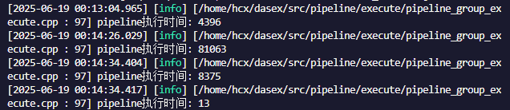

# 性能优化报告/文档

---

### 韩晨旭 李畅

---

## Hash Join性能优化

为了提高TPCH测试中各种查询的性能，我们首先尝试对Hash Join算子进行优化。

### 哈希冲突造成的性能影响

在Hash Join算子执行的过程中，哈希冲突对性能的影响是显著的，最直接的影响就是 **探测成本增加了**，在Probe阶段，每个键通过hash值定位到桶(bucket)，再线性查找比较桶内的所有entry。如果哈希冲突严重，每个桶内entry数量很多，会导致哈希连接的效果差。最极端的情况下，所有键都落在同一个bucket内，此时理论复杂度和NestedLoopJoin相同，但由于额外的哈希计算反而会导致性能降低。

本数据库中的Hash Join采用的是固定大小的哈希表，在哈希表大小固定时，随着表的大小增加，哈希冲突数量不可避免的会上升，**如何减缓哈希冲突导致的Probe性能下降** 是我们第一个尝试优化的问题：

### TagInfo

下面通过一个例子讲解哈希冲突对Probe造成的性能影响：

为了方便，这里假设每个entry的`Hash value`为32位，低12位作为哈希键。假设Build端有这四行数据：

| 行 | Hash value |
|:---:|:---:|
|Row 1|0x123ab123|
|Row 2|0x234cd123|
|Row 3|0x123ab123|
|Row 4|0x21abc123|

其中Row 1和Row 3的哈希值相同，而与Row 2和Row 4的不相同。由于低12位作为哈希键，因此这四行数据的哈希键都是**0x123**，存放在了哈希表中的同一个`bucket`中。

假设Probe时右表有两行数据：

| 行 | Hash value |
|:---:|:---:|
|Row 1|0x765da123|
|Row 2|0x21c8b123|

这两行数据的哈希键也是**0x123**，因此在Probe阶段这两行数据都要与Build端的4行数据进行比较。然而，由于它们的实际哈希值与上面4行数据均不匹配，这8次比较都以失败告终。这样的情况发生过多无疑会导致性能问题。

数据库原本实现中，采用了全局的Bloom Filter记录所有build端的hash key，然后对于每次probe，都先通过Bloom Filter判断该条probe的hash key是否存在于build中，如果发现不存在则直接跳过该条记录。然而，此Bloom Filter是全局使用的，若build端数据较多会导致误判率较高，从而导致更多的无效探测。

我们引入了 `Tag Info` 来对每个bucket中的条目进行过滤，每个bucket保存自己对应的 `Tag Info`：

首先对 `Tag Info` 进行介绍：

`Tag info` 使用 `Hash value` 的前n位进行操作。`Tag info` 存储在bucket中，初始值为0，假设哈希值长度为64位，在每次bucket中有新条目进入时更新，对于 `Hash value` 为 `hash` 的新条目，更新方式为：
$$
TagInfo = TagInfo | (hash >> (64-n))
$$
继续使用上面的例子，我们假设这里取 n = 12。那么上述Build端的数据的`Tag info`即为：

| 行 | Hash value | Tag info |
|:---:|:---:|:---:|
|Row 1|0x123ab123|0x123|
|Row 2|0x234cd123|0x234|
|Row 3|0x123ab123|0x123|
|Row 4|0x21abc123|0x21a|

+ 初始化bucket时，Tag info = 0；
+ 存入Row 1时，Tag info 更新为 0 | 0x123 = 0x123；
+ 存入Row 2时，Tag info 更新为 0x123 | 0x234 = 0x337；
+ 存入Row 3时，Tag info 更新为 0x337 | 0x123 = 0x337；
+ 存入Row 4时，Tag info 更新为 0x337 | 0x21a = 0x33f。

于是得到此时存入改bucket的 Tag info 为0x33f。

此时，在Probe阶段进行Join key比较前，可以先对`Tag info`进行比对，以举例的两行数据为例：

+ Row 1的Tag info为0x765，由于0x765 | 0x33f != 0x33f，则可以确定Row 1的哈希值肯定不会与Build端的任何一行哈希值相同，因此无需再进行比对；
+ Row 2的Tag info为0x21c，由于0x21c | 0x33f == 0x33f，无法排除Row 2的哈希值与Build端某一行哈希值相等的可能性，需要再进一步比对Join key。

这部分的原理与Bloom Filter类似，这种做法可能与给每个bucket都生成一个Bloom Filter是等价的(需要严谨证明，不确定)。

在这个例子中，引入`Tag info`后，需要进行最终会失败的Probe比较的次数由8次减少到4次。

在我们的实现中，由于引入 `Tag info` 是为了取代Bloom Filter，因此n取值为哈希值的长度，即使用完整的哈希值。

新引入的 `Tag info` 仅进行高速的位运算，且由于每个bucket分离，误判率通常低于Bloom Filter，在Q4中测试表现如下：


综合来看对于Q4查询速度提升约5%。

代码位于 `src/operator/join/hashjoin/join_hashtable.*, EntrySingle，TupleBucket增加了成员，TupleBucket::InsertEntry()增加了taginfo计算，Gather*Data中增加了taginfo过滤`

### 哈希聚合算子优化

通过调研相关文章，我们发现在TPCH的查询测试中，Aggregation算子是对Q4查询性能有较为严重的影响，因此第二个优化选择了 Hash Aggregation。

这部分其实同样是对于哈希冲突的优化，在Build中我们选择保留定长哈希表，采用 `Tag info` 缓解哈希冲突的影响，是考虑到build表可能较为庞大，调整哈希表大小的操作可能会带来更多的开销，超过减少哈希冲突带来的提升。在哈希聚合算子的优化中，我们选择了动态扩容哈希表，通过提升bucket数量来直接减少哈希冲突：

现有代码的实现中，相关功能模块的实现如下：
```css
[RadixPartitionTable]
    └─ N 个 [AggHashTable]  ← 按照低位哈希将输入划分到 N 个子表
          └─ M 个 [AggBucket] ← 每个 bucket 管理若干条聚合 entry
                └─ K 个 [EntrySet] ← 每个 EntrySet 是一个具体的聚合 group
```

其中`AggHashTable`和`AggBucket`分别是哈希表和桶的抽象。其中，哈希桶的数量是固定的，在entry数量增多时，不可避免的会导致单个bucket中的entry增多，而单个bucket中entry过多直接带来的影响就是哈希的性能变差(哈希冲突严重)。

动态扩容实际上就是在达到一定条件时(例如bucket平均条目数量超过了一个阈值)，将bucket数量进行翻倍(哈希值多取一位)，将当前条目重新散列到扩容后的哈希表中，由于哈希值增加了一位，预期上可以让平均每个bucket中的条目减少一般，对哈希表的查询性能会带来巨大的提升，但是由于哈希表扩容也会有一定的开销，因此频繁扩容可能会导致性能下降，我们使用每个使用中的bucket的平均条目数作为扩容的条件，设置了一个config变量 `AVG_BUCKET_LOAD_THRESHOLD` 用于控制当平均条目达到多少时进行扩容。最终实验时我们将改值设置为16。

Resize实现方式即重新构建哈希表，将原有的entry散列到新的扩容后的bucket中，最终效果为：


这里是同时应用了上述 `Tag info` ，相比仅使用`Tag info`的查询速度提升了约12%。(不稳定，可以达到95000ms左右)

代码位于 `src/operator/agg/aggregation_hashtable.*`，扩容方法为：
```cpp
void AggHashTable::ResizeBuckets() {
    int new_bucket_num = bucket_num * 2;
    std::vector<std::shared_ptr<AggBucket>> new_buckets(new_bucket_num);
    std::vector<int8_t> new_bucket_map(new_bucket_num);
    used_bucket_num = 0;

    for (int i = 0; i < bucket_num; ++i) {
        if (bucket_map[i] == 0 || buckets[i] == nullptr) continue;
        for (auto &entry : buckets[i]->bucket) {
            if (!entry) continue;
            size_t new_hash = entry->key->hash_val;
            int new_idx = new_hash & (new_bucket_num - 1);
            if (new_buckets[new_idx] == nullptr) {
                new_buckets[new_idx] = std::make_shared<AggBucket>();
                new_bucket_map[new_idx] = 1;
                used_bucket_num++;
            }
            new_buckets[new_idx]->InsertEntrySet(entry);
        }
    }

    buckets = std::move(new_buckets);
    bucket_map = std::move(new_bucket_map);
    bucket_num = new_bucket_num;
}
```

#### **优化尝试**

理论上，对于聚合哈希算子，哈希表在改为动态扩容后也可以继续引入 `Tag info` 来进一步减缓哈希冲突带来的影响，但是在简单尝试过后发现，引入 `Tag info`  后，性能反而出现了些许下降，原因大概是扩容后本身每个bucket中的条目数都不太多，进行 `Tag info`  相关计算的时间相对于遍历他们进行比较的时间不算非常小，不可忽略，所以最后性能反而因为计算 `Tag info`  而下降，因此最终仅采用了哈希表动态扩容。

### 其他优化

**Bit_map优化**

对Hash Join算子中原有的`bit_map`进行了优化：

位于 `src/operator/join/hashjoin/join_hashtable.hpp, ProbeState类中`

+ 原先实现为std::vector<int8_t>，每行对应一个元素，存储开销为8bit。每个元素1表示匹配，0表示未匹配；
+ 优化后的实现为std::vector<uint64_t>，每bit对应一个元素，存储开销为原来的1/8。每位用1表示匹配，0表示未匹配，相应地使用位运算对其进行更改和查找。

这一项优化是针对`bit_map`的空间存储开销的，对于查询速度没有明显影响。

**局部性优化**

在Hash Join算子里的ProbeState类添加了一个变量`matched_entries`，用来记录探测到的entry的信息，本意是避免其在`GatherData()`函数中反复调用`AppendRowToValueVec()`函数，而是在最终 `GetJoinResult` 的时候一起添加。后来注意到`AppendRowToValueVec()`函数是 `inline` 的，那么理论上应该不会对性能产生影响。

结果在实际运行的时候，发现使用原本的代码（即调用`AppendRowToValueVec()`函数）查询速度不如我修改后的代码的查询速度，令人疑惑。

关于这里的提升有两个可能的推测：

- 编译器在编译的时候并没有采用inline的建议，导致这部分进行了循环内的函数调用，将其推至 `GetJoinResult` 起到了向量化的效果，这个需要查看编译器最终生成的汇编来验证，但是更有可能是第二个原因
- 推至 `GetJoinResult` 再进行 `AppendRowToValueVec()` 相同的操作，由于已经有了所有probe到的数据，直接循环遍历进行操作时会有更好的局部性。而原本的做法中，每次probe命中就进行该操作，如果probe长时间未命中后突然命中，可能会导致局部性变差，没有有效利用到cache，这种说法也比较符合多次实验中的现象：原本的做法Q4执行时间在 95000和130000左右波动，多数情况为130000(上一张截图)，而更改后Q4执行时间基本稳定在95000左右(最终结果)

因为第二个原因的可能性更大，这里归类为对局部性的优化

代码位于 `src/operator/join/hashjoin/join_hashtable.cpp, GatherData(), GetJoinResult()`

### 结果：

未进行优化改动时，原本运行TPCH-Q4的速度：


最终所有改动全部应用后的Q4查询运行结果：




综合来看相比最原始的查询速度提升41%。